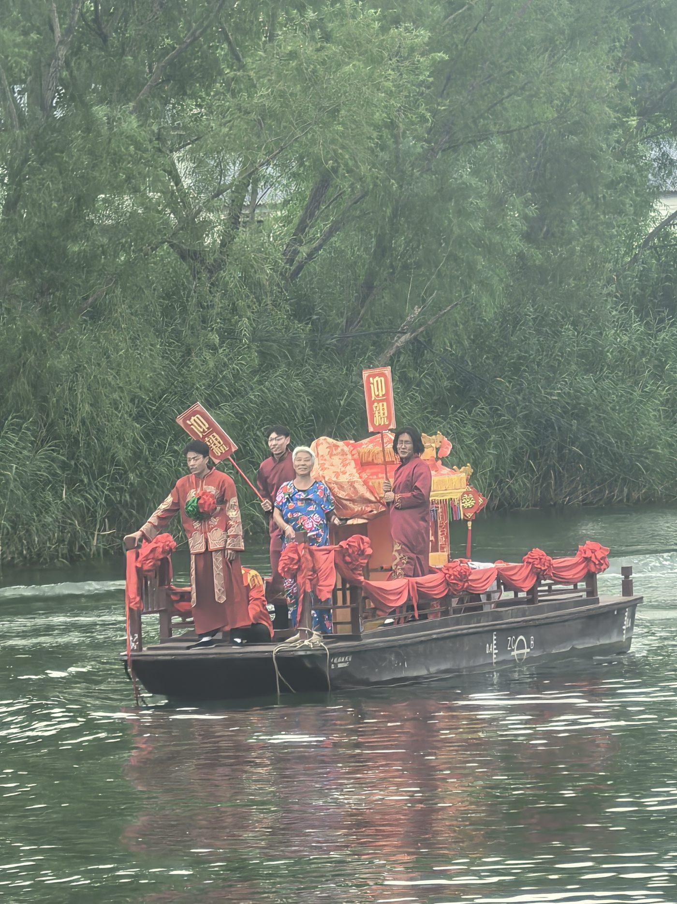

# 青翎引路 · 人淀共生

白洋淀散点化文旅资源智慧融合与具身传播路径调研（挑战杯 · 哲学社会科学类调查报告）。

## 如何打开

双击 `index.html` 即可，不需要装任何环境、不需要联网。

## 四个页面

### index.html　封面页

照着杂志编排风格做的一整屏封面：全幅照片打底，左上角是大字号衬线标题，中间偏左是 `EXPLORE` 胶囊入口。

**这一页没有导航栏。**

进入内容界面只有一种方式：**点中间的 `EXPLORE` 按钮**。点击后会升起一道幕布，
再切到 `explore.html`。（按代码里的说明，这一页不响应鼠标滚动和触屏滑动。）

左边还有「观看影片」按钮，目前没有真实影片，点击会提示「影片尚未上传」。

### explore.html　内容首页（单屏，不滚动）

这一页**锁在一屏之内，整页不能上下滚动**，从上到下四层：

| 位置 | 内容 |
| --- | --- |
| 顶部 | 导航栏（8 个栏目 + 下拉 + 开始探索按钮） |
| 上部 | 项目标题「青翎引路，人淀共生。」与一行说明 |
| 中间偏左 | **认识白洋淀**：一个空框架，等着往里填内容 |
| 中间偏右 | **最近更新**：最近发布的文章，点标题直接进全文 |
| 底部 | **白洋淀相册**：一条接近通屏的矮带子，照片会自动滚动播放 |

导航栏从左到右依次为：

首页 → 项目概况 → 我们的调查 → 人淀共生理念 → 白洋淀特色资源库 → 青翎AI交互中心 → 旅游路线推荐 → 团队介绍 → 联系我们

最左边的「首页」指向单屏首页（`explore.html`），停在首页时会显示为选中状态。
中间那两块面板**左右等宽**：宽屏下「认识白洋淀」在左、「最近更新」在右；
窄屏（980px 以下）改成上下摞起来，并且**「最近更新」在上面**，因为它更常用。

鼠标移到「我们的调查」上，下方会展开 **文章** 和 **相册** 两个选项。

导航上的 8 个栏目都指向 `content.html` 里对应的那一屏，点一下**直接换一屏**。

因为整页不滚动，三处细节是这样处理的：

- 「最近更新」文章变多时，**只有这个列表内部滚动**，页面本身仍然不动。
- 窗口变矮（比如小笔记本、横屏手机）时，自动压缩标题与面板，优先保证一屏放得下。
- 平板和手机上，中间两栏改成上下堆叠，堆叠区可以上下滑，页面整体依然锁在一屏。

### content.html　栏目页（一栏一屏，同样不滚动）

8 个栏目的正文都在这一个文件里，但**每个栏目各占一屏，整页依然不能上下滚动**。

它的切换方式是把栏目名写在地址栏的 `#` 后面，比如：

| 栏目 | 地址 |
| --- | --- |
| 项目概况 | `content.html#overview` |
| 我们的调查 | `content.html#research` |
| 相册 | `content.html#album` |
| 白洋淀特色资源库 | `content.html#resources` |
| 青翎AI交互中心 | `content.html#qingling` |
| 团队介绍 | `content.html#team` |

点导航就是换这个 `#`，所以是**瞬间换一屏**，不会出现往下滑的动作。
直接双击打开 `content.html`（不带 `#`）会自动落在「项目概况」。

**「联系我们」不在上面这个表里**——它没有独立的一屏，而是导航栏上鼠标移上去
展开的邮箱入口，点一下就会打开写邮件窗口，收件人已经填好。要改这个邮箱地址，
在 `explore.html` 和 `content.html` 里各搜一次 `mailto:` 就能找到。

每屏右下角有一条「青翎引路 · 人淀共生」的收尾线，右上角的「返回首页」回到单屏首页。

### 栏目里的正文怎么写

「项目概况」是**整屏文字页**：没有左侧大标题，正文占满整屏、居中排版，
内容长的时候只有正文区内部滚动，页面本身依然不动。它的结构是一个
`<div class="reading">` 包着一个 `<article class="prose">`，段落直接写在里面：

| 想写什么 | 用什么标签 |
| --- | --- |
| 段落 | `<p>文字</p>` |
| 小标题 | `<h3>小标题</h3>` |
| 列表 | `<ul><li>要点</li></ul>` |
| 加粗强调 | `<strong>文字</strong>` |
| 引用 | `<blockquote><p>引文</p></blockquote>` |
| 插图 | `<figure></figure>` |

一行大约排四十个字，是中文读起来比较舒服的行长，不用自己控宽。

「旅游路线推荐」用的不是纯文字版式，而是**一条线路一张卡片**：
左边是点位图，右边是点位链路（竖向圆点时间轴）加一段设计说明，最后附一份
「三条线路一览」对照表。它的结构是 `<div class="service">` 里放若干
`<article class="route">`，每个卡片里 `figure` 放图、`ol.chain` 放点位。
要加第四条线路，复制一整个 `<article class="route">` 改内容即可。
点位图放在 `assets/img/`，命名如 `route-eco.png`。

## 文件结构

```
web/
  index.html          封面页
  explore.html        内容首页 —— 单屏，不滚动，含导航 / 最近更新 / 认识白洋淀 / 相册带
  content.html        栏目详情页 —— 6 个栏目各占一屏，靠 # 切换，整页不滚动
  philosophy.html     人淀共生理念专页 —— 允许整页滚动，含五个板块
  routes.html         旅游路线推荐专页 —— 允许整页滚动，含三条线路
  articles/           文章文件夹，每篇文章一个 .html
    _文章模板.html     复制这一份来写新文章
  assets/
    styles.css        全部样式，分「封面页 / 内容界面」两大段
    article.css       文章页专用样式（articles/ 里的页面用这一份）
    philosophy.js     人淀共生理念专页的交互（维度切换 / 散点演示 / 对话 / 旅程）
    app.js            进入内容界面、下拉菜单、手机端导航
    img/              图片素材
  copy-to-E-web.bat   双击即可把整个网站复制到 E:\web
```

## 关于「人淀共生理念」专页

导航上「人淀共生理念」和「旅游路线推荐」是两个**独立成页**的栏目，文件分别是
`philosophy.html` 和 `routes.html`。原因很简单：这两页都要允许整页上下滚动，
而 `content.html` 是靠地址栏的 `#` 做「一栏一屏、整页不滚动」切换的，
两者机制冲突，所以单独拆开。

鼠标移到导航的「人淀共生理念」上，会展开五个子项，点击就会滚动到对应位置：

| 子导航 | 页面里的位置 | 内容 |
| --- | --- | --- |
| 核心理念 | `philosophy.html#concept` | 三个共生维度（生态 / 文化 / 主客）＋ 数字传播闭环 |
| 散点融合 | `philosophy.html#scatter` | 四阶段动态图 ＋ 四类「孤岛」 |
| 青翎智能体 | `philosophy.html#agent` | 智能体形象 ＋ 对话演示 ＋ 六项能力 |
| 沉浸场景 | `philosophy.html#immersive` | 行前 / 在淀 / 红色 / 民俗 / 行后 五段旅程 |
| 理论支撑 | `philosophy.html#theory` | 四套理论，点击卡片展开详情 |

要改文案，直接在 `philosophy.html` 里搜对应文字。四个阶段的说明文字和「青翎」的
四组问答在 `assets/philosophy.js` 顶部的 `copy` 和 `responses` 两个变量里。

## 关于「旅游路线推荐」专页

文件是 `routes.html`，同样是整页滚动的长页。鼠标移到导航的「旅游路线推荐」上，
会展开三条线路，点击滚动到对应卡片：

| 子导航 | 位置 |
| --- | --- |
| 生态民俗体验线 | `routes.html#eco` |
| 红色生态研学线 | `routes.html#red` |
| 现代湿地科技观鸟线 | `routes.html#bird` |

每张卡片是「左边点位图 ＋ 右边点位链路时间轴 ＋ 设计说明」，页面最下面是
「三条线路一览」对照表。点位图放在 `assets/img/`，命名如 `route-eco.png`。

## 怎么加文章

文章都放在 `articles/` 文件夹里，**一篇文章就是一个 .html 文件**。

目前已有的文章：

| 文件 | 内容 |
| --- | --- |
| `01-重访白洋淀.html` | 第二轮调研手记（叙事长文，带题图） |
| `02-专访一-淀边农家院经营者.html` | 人物专访，问答体 |
| `03-专访二-纪念馆讲解员.html` | 人物专访，问答体 |
| `04-专访三-淀中村民.html` | 人物专访，问答体 |

（`01-示例文章.html` 是最早的排版示例，已经从两个列表里撤下来，留着当参考，确认不需要了可以删。）

### 问答体怎么写

访谈类文章用 `<div class="qa">` 包住问答，问题用 `.qa__q`、回答用 `.qa__a`：

```html
<div class="qa">
  <p class="qa__q">调研组：问题内容？</p>
  <p class="qa__a">回答内容。</p>
</div>
```

问题会自动加粗，回答会缩进并带一道细线，一眼能看出谁在说话。

### 三步加一篇

1. 复制 `articles/_文章模板.html`，粘贴在同一层，把文件名改成你想要的名字，例如
   `02-七月的船工访谈.html`。文件名建议用「序号-标题」，方便排序。
2. 用记事本 / VS Code 打开它，按模板里的 ①②③④⑤⑥ 编号注释逐项替换成你的内容。
3. 把文章挂到列表上，要改两个地方：
   - `explore.html` 里 `<ol class="updates">` —— 首页「最近更新」，放最近 1～3 篇。
   - `content.html` 里「我们的调查」那一屏（`id="research"`）的 `<ol class="posts">` —— 完整文章列表。

   两处都是照着已有的那一条 `<li>` 复制一份，改掉链接文件名、日期、标题和摘要。

改完双击 `explore.html`，「最近更新」里就能看到并且点进去了。

### 写作时要注意的两件事

- **图片**：放到 `assets/img/` 里，文章里用 `../assets/img/文件名.jpg` 引用。
  （文章在 `articles/` 里，所以要 `../` 先退回上一层。）
- **手机上能看**：模板已经做好了手机适配，段落、图片、表格都会自动适应屏幕宽度。
  你只需要**不要把长表格直接贴在正文里**——用模板里的
  `<div class="table-scroll">` 包一层，手机上就能左右滑动而不是撑破页面。

### 模板里能用的东西

| 想写什么 | 用模板里的哪一段 |
| --- | --- |
| 一级 / 二级小标题 | `<h2>` / `<h3>` |
| 加粗、放链接 | `<strong>` / `<a href="…">` |
| 项目符号列表 | `<ul><li>…</li></ul>` |
| 引用原话、报告原文 | `<blockquote>` |
| 插图 + 图注 | `<figure>` 整段复制 |
| 表格 | `<div class="table-scroll">` 包住 `<table>` |
| 分隔线 | `<hr />` |

不需要的段落整段删掉即可，删掉不会影响排版。

## 怎么换相册照片

底部那条相册带现在是 6 个虚线占位（为了无缝循环，在 HTML 里复制成了两组 12 个）。

换真实照片时：

1. 把照片放进 `assets/img/`。
2. 在 `explore.html` 里找到 `<ol class="reel__track">`，把每一个
   `<li class="reel__slide">…</li>` 换成（注意多了 `reel__slide--photo` 这个类名）：

   ```html
   <li class="reel__slide reel__slide--photo">
     
   </li>
   ```

3. **两组都要改**（第二组带 `aria-hidden="true"`，是给无缝循环用的副本）。
   两组的照片必须完全一样，滚动衔接才不会跳。
4. 想在 6 张之外增减张数也可以，只要保证两组内容一致。

照片建议横构图，尺寸 400×260 左右就够——这条带子很矮，图片会按 `object-fit: cover`
裁切填满，不会变形。滚动速度在 `styles.css` 里搜 `reelScroll`，改 `46s` 这个数
（数字越大越慢）。鼠标移上去会自动停住。

## 想改内容去哪里找

| 想改的东西 | 位置 |
| --- | --- |
| 封面页大标题、两行副标题 | `index.html` 的 `hero__title`、`hero__sub` |
| 封面页小字、顶部细条文字 | `index.html` 的 `eyebrow`、`strip` |
| EXPLORE 按钮文字 | `index.html` 里 `btn__latin` 与 `btn__cn` |
| 封面页照片 | 换掉 `assets/img/hero-sunset.jpg` |
| 导航栏文字与顺序 | `explore.html` 里 `menu__list`（`content.html` 里也有一份，两处要一起改） |
| 「我们的调查」下拉的两项 | `explore.html` 里 `menu__panel` |
| 主色（深蓝） | `styles.css` 顶部 `--navy` |
| 首页中部两块面板 | `explore.html` 的 `#updates`（最近更新）与 `#about`（认识白洋淀） |
| 底部相册带 | `explore.html` 的 `<ol class="reel__track">` |
| 各栏目正文 | `content.html` 对应 `id` 的 `<section>` |
| 文章正文 | `articles/` 里对应的那个 `.html` |
| 最近更新列表 | `explore.html` 的 `<ol class="updates">` |
| 完整文章列表 | `content.html` 的 `#articles` 下面 `<ol class="posts">` |

## 样式说明

- 字体用的是系统自带的衬线体做标题（思源宋体 / 宋体一类），正文用系统黑体，不加载任何在线字体，所以断网也能正常显示。
- 圆角只有一套规则：按钮是胶囊形，面板和图片是 12px。
- 照片左上角加了一层很淡的白色提亮，保证深蓝文字压在天上也能看清；底部压暗，让角标读得清。
- 已适配桌面、平板、手机；手机端导航收进右上角的方形按钮里。
- 系统开启「减少动态效果」时，照片的缓慢缩放和箭头跳动会自动停下。

单屏首页（`explore.html`）还多两条规则：

- 整页 `overflow: hidden`，高度写死成 `100dvh`，所以永远不会出现滚动条。
- 底部的相册带是「无限循环走马灯」：轨道里放了两组完全一样的照片，动画位移
  50% 正好接上第二组。之所以能用 `gap` 之外的 `margin-right` 排间距，也是为了让
  一半的宽度刚好等于一组的宽度，接缝才不会跳。
- 中间两块面板在 HTML 里是「最近更新」在前，宽屏并排时用 CSS 的 `order`
  把「认识白洋淀」换到左边。这样窄屏摞起来时顺序还是「最近更新」在上。
  想让并排顺序换回去，删掉 `styles.css` 里 `.hub__mid > #about / #updates`
  那两行即可。

栏目页（`content.html`）同理：

- 整页 `overflow: hidden`，每个栏目是一屏，靠 CSS 的 `:target` 切换显示哪一屏，
  所以点导航是换一屏而不是滚动。
- 每一屏的正文栏留了「内容真的放超了」的兜底：只有那一栏会内部滚动，
  页面本身永远不动。目前都是占位内容，不会出现滚动条。
- 文字内容以后如果变多，一屏装不下，告诉我，我把那一屏单独放开。

## 部署到 Vercel（在线版）

本地这份是「双击就能看」的离线版；在线版部署在 Vercel 上，用你自己的域名访问。

### 日常更新流程

1. 双击 `publish-to-E-web.bat` —— 把最新文件同步到 `E:\web`（离线版也就更新了）。
2. 双击 `deploy-to-vercel.bat` —— 它会先把 `E:\web` 的内容复制进 `vercel-project\`，
   再执行 `vercel --prod` 部署。第一次会自动安装 Vercel 命令行工具。

第一次部署时命令行会问几个问题，这样回答：

| 问题 | 回答 |
| --- | --- |
| Set up and deploy …? | `y` |
| Which scope …? | 直接回车（选你自己的账号） |
| Link to existing project? | 第一次填 `n`，以后它会记住 |
| What's your project's name? | 直接回车（或自己起个名字） |
| In which directory is your code located? | 直接回车（`./`） |

部署完终端会打印一个网址，那就是线上版。

### AI 接口要配两个东西

**一是模型 ID。** 打开 `vercel-project/api/chat.js`，找到这一行：

```js
const MODEL = "在这儿填你的模型ID";           // ←← 只改这一行
```

换成硅基流动模型广场里的完整模型 ID（带斜杠的那一串）。

**二是密钥。** 到 Vercel 项目 → **Settings → Environment Variables**，
新增一条，名字叫 `SILICONFLOW_KEY`，值就是硅基流动的密钥。
**改完环境变量必须在 Deployments 里点一次 Redeploy 才会生效。**

两个都配好之后，打开网站的「青翎AI交互中心」，顶部的状态会从
「离线演示模式」变成「已接入大模型」。

### 接口没接通时会怎样

网站不会白屏也不会报错。`assets/app.js` 会先探测 `/api/chat` 在不在：
在就用真模型（流式逐字显示），不在就自动回落到预置问答，状态栏会写明当前是哪种模式。
所以断网、额度用完、部署没配好，都不影响演示。

### 目录说明

```
publish-to-E/
  publish-to-E-web.bat    只同步到 E:\web（离线版）
  deploy-to-vercel.bat    同步 + 部署到 Vercel（在线版）
  vercel-project/         部署用，内容每次从 E:\web 刷新
    api/chat.js           AI 接口（密钥走环境变量，不写在里面）
    package.json          让 Vercel 按 ES Module 解析 api/ 里的文件
```

## 待补充

- `content.html` 各栏目的正文、图片与图表
- 首页「认识白洋淀」框架里的内容
- 底部相册带的真实照片
- 「观看影片」目前没有真实影片，点击会提示「影片尚未上传」，有片子后把 `index.html` 里 `watchFilm` 换成影片链接即可
